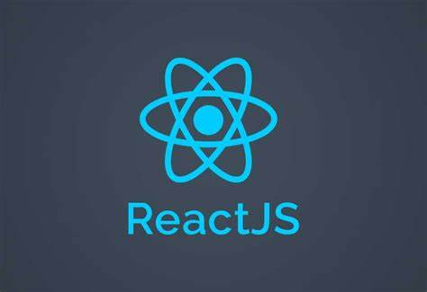
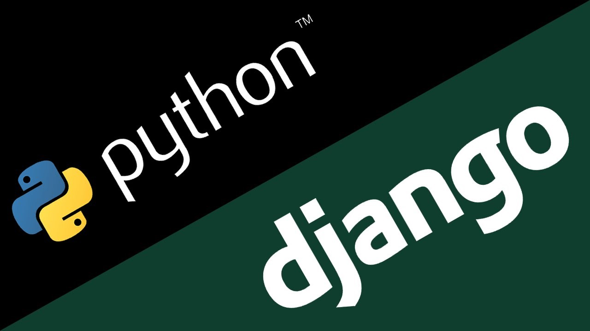

# Project_Intern_Hopee
 Project intern dev python use framework Django to back-end and ReactJS to front-end

 Framework used in the project

# ReactJS:18.2 

To start React run comand:

### `npm start`

Runs the app in the development mode.\
Open [http://localhost:3000](http://localhost:3000) to view it in your browser.

# Django:4.5 and python 3.11

First Create Virtual Environment Use Comand

Windows: 
### `python -m venv venv`

Unix/MacOS: 
### `python -m venv venv`

Then used comand python inport library your project

If you want to use the library you just imported the command:
Windows:
#### `venv\Scripts\activate.bat`
Unix/MacOS:

#### `source myworld/bin/activate`
Then  install django use comand:

### `python -m pip install Django`

if you want create project you can use command:

### `python django startproject Name_Project`

then use want to create new app for project use command:
### `python manage.py startapp Name_App`

finally you run command :
### `python manage.py runserver`
to run the sever